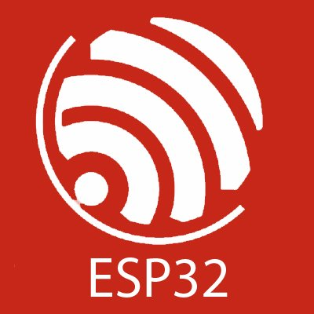

## Who am I?
My name is Goran and I am an electrical engineer who loves to code and learn new stuff. In my free time I make electronics projects (Arduino & ESP32 boards), print stuff on my 3D printer, code, and try to learn new stuff every day. 

## What am I interested in?
I am interested in solving problems with Python (NumPy, Tensorflow, Pandas) in my everyday job. Also I use OpenDSS combined with Python. 

## What tools and languages do I use?

### Languages

   

### Embeded systems and hardware

   

### Other tools and software

   

## Connect with me:

<a href="https://www.linkedin.com/in/goran-%C5%A1ostarko-b6a10647/">    
  
## Python projects
### Scripts
[Duval triangle ploting script](https://github.com/gsostarko/duval_triangle) is a simple Python script that lets you plot a Duval triangle by entering %CH4, %C2H2 and the %C2H4 values.

[Circulating currents calculating script](https://github.com/gsostarko/circulating_currents) is a Python scrip that calculates the circulating current valuse for two parallel power transformers for every connection combination. The main goal of this script is to show what connection types of transformers can work in parallel.

### Apps 
**Comming soon**

